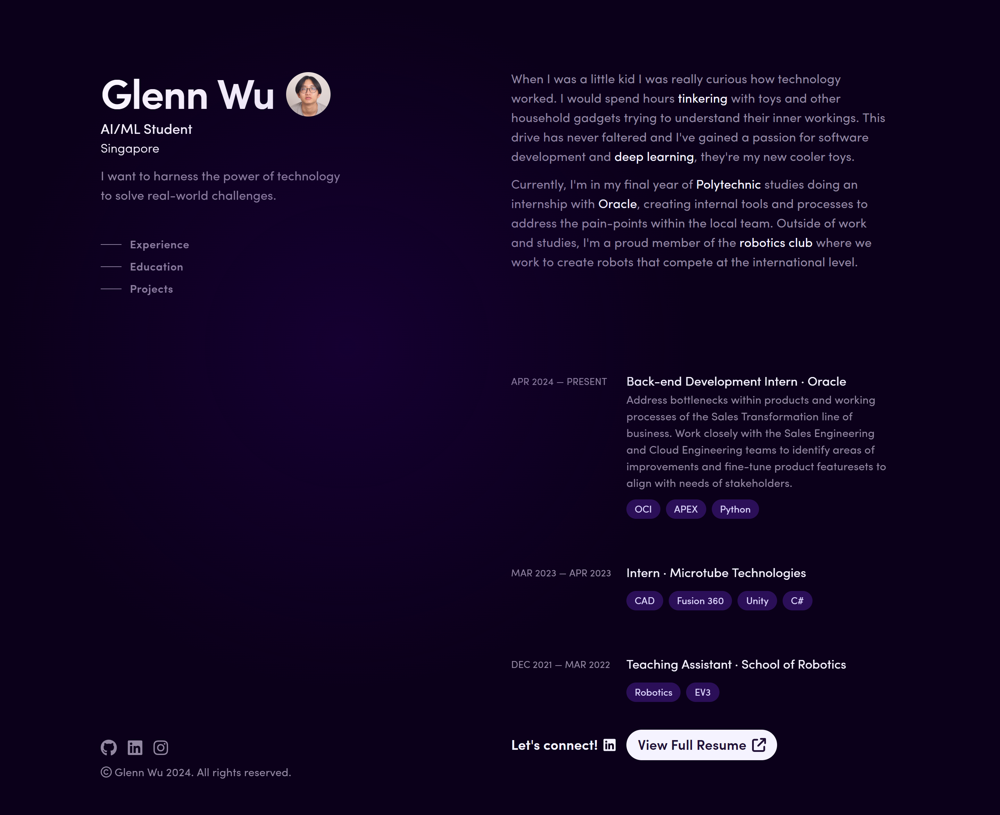

<h1 align="center">
  me.glennwu.com
</h1>
<p align="center">My first "complete" personal site. Built with <a href="https://vuejs.org/" target="_blank">Nuxt.js</a> and <a href="https://tailwindcss.com/" target="_blank">TailwindCSS</a>. Available at <a href="https://me.glennwu.com" target="_blank">me.glennwu.com</a>.</p>



## Installation

1. Clone the repository:

   ```
   git clone https://github.com/glennwuwu/v1.git
   ```

2. Navigate to the project directory:

   ```
   cd v1
   ```

3. Install the dependencies:

   ```
   npm install
   ```

## Acknowledgements

This site was heavily inspired by [brittanychiang.com](https://brittanychiang.com/)

## License

This project is licensed under the MIT License.
